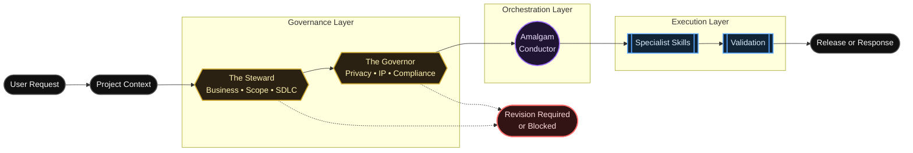

<div align="center">
  

  <p>
    <strong>Project-agnostic governance and orchestration framework for AI-assisted development.</strong>
  </p>

  <p>
    <a href="INSTALLATION.md">Installation</a> •
    <a href="docs/governance/GOVERNANCE_LAYER.md">Governance</a> •
    <a href="SKILL_INDEX.md">Skills</a> •
    <a href="VALIDATION.md">Validation</a>
  </p>
</div>

---

## At a Glance

| Layer | Role | Purpose |
|---|---|---|
| Governance | The Steward | Business, scope, SDLC, requirements, and value alignment |
| Governance | The Governor | Legal risk, privacy, IP, licensing, security, and compliance review |
| Orchestration | Amalgam Conductor | Routes approved work to the correct specialist skills |
| Execution | Specialist Skills | Performs focused implementation, documentation, QA, security, or design work |

## Core Concept

Amalgam Conductor uses a governance-first workflow. The Steward checks whether a request aligns with project goals, scope, requirements, and SDLC documentation. The Governor checks whether the request raises legal, privacy, IP, licensing, security, or compliance concerns. Once governance review is complete, the Amalgam Conductor routes approved work to the correct specialist skills.

## Architecture



---

## Governance Layer

The Governance Layer sits above the Conductor. It intercepts incoming requests, identifies the minimum project context required, and performs a risk-scaled review (LOW, MEDIUM, or HIGH) before any implementation begins.

> [!IMPORTANT]
> If a request violates alignment, fails scope verification, or breaches compliance boundaries, the Steward or Governor issues a `REVISION_REQUIRED` or `BLOCKED` status. The Conductor will immediately halt execution.

### The Steward

Validates business alignment, scope boundaries, and software development lifecycle (SDLC) documentation. It ensures changes stay within the scope of work and meet defined acceptance criteria.

### The Governor

Evaluates legal compliance, privacy risks, intellectual property (IP), licensing, and security policies. It flags high-risk regulatory or legal matters for manual human review and does not provide formal legal advice.

---

## The Amalgam Conductor

The Amalgam Conductor operates in the Orchestration Layer. Once governance clearance is granted:
- It defines execution steps and establishes architectural boundaries.
- It sequences actions to prevent multi-file conflicts and overlapping agent reviews.
- It routes implementation tasks to the correct specialized skills.

## Specialist Skills

| Skill | Focus |
|---|---|
| Amalgam Conductor | Routing and orchestration |
| The Steward | Business, scope, SDLC, and requirements alignment |
| The Governor | Privacy, IP, licensing, compliance, and legal-risk review |
| Clockwork Meister | Architecture, OOP, refactoring |
| Cloak Meister | UI, UX, layout, accessibility |
| Scribe Meister | Documentation and technical writing |
| Acme Overseer | QA, testing, release readiness |
| Cipher Meister | Security and privacy evidence |

For details on all execution skills, routing logic, and behavioral constraints, see the [Specialist Skill Index](SKILL_INDEX.md).

---

## Installation

To set up Amalgam Conductor as an installable AI workflow plugin:

### Antigravity Setup
```sh
agy plugin install https://github.com/Baelfyre/amalgam-conductor
```

### Codex Setup
Clone this repository directly into your Codex plugins directory:
```sh
git clone https://github.com/Baelfyre/amalgam-conductor.git
```

For manual configurations or environment setup details, see the [Installation Guide](INSTALLATION.md).

## How to Use

The plugin operates on a structured, context-first prompt pattern. 

### Step 1: Provide Project Context
Identify the project context profile (Project Type, Sensitivity, Jurisdiction, etc.) so the Governance Layer can properly scale its review risk.

### Step 2: Use the Governance-First Prompt Pattern
Always structure your requests to invoke the orchestrator with the necessary context and clear execution goals.

## Recommended Prompt Workflow

Use this format to initiate tasks:

```markdown
[@ponytail] use amalgam-conductor for this task

Task:
Describe the work clearly.

Context:
Provide the project type, current files, constraints, and goal.

Requirements:
List what must be changed or preserved.

Expected Output:
Changed Files:
Summary:
Validation Results:
Remaining Risks:
Next Recommended Step:
```

## Token-Efficient Usage

> [!TIP]
> - Start with a refined prompt.
> - Provide only relevant context.
> - Ask for changed files, summary, validation, risks, and next step.
> - Use expanded governance only for medium-risk or high-risk work.
> - Use fast path for typo fixes, formatting, and local documentation cleanup.
> - Link to detailed governance docs instead of repeating them in README.

---

## Documentation Map

| Area | Start Here | Purpose |
|---|---|---|
| Governance | [Governance Layer](docs/governance/GOVERNANCE_LAYER.md) | Understand The Steward, The Governor, risk scaling, and release gates |
| Skills | [Skill Index](SKILL_INDEX.md) | Review available specialists and routing behavior |
| Installation | [Installation Guide](INSTALLATION.md) | Set up the plugin in Antigravity or Codex |
| Validation | [Validation Guide](VALIDATION.md) | Run structure and manifest checks |
| Disclaimer | [Disclaimer](DISCLAIMER.md) | Understand legal and operational limitations |

## Validation

Before releasing or pushing changes, verify the plugin structural integrity and manifest alignment:

```powershell
# Verify files, directories, and icon overrides
powershell -ExecutionPolicy Bypass -File .\scripts\validate-structure.ps1

# Verify manifest properties against skill frontmatter
powershell -ExecutionPolicy Bypass -File .\scripts\validate-manifest.ps1
```
For more information, see the [Validation Guide](VALIDATION.md).

---

## Limitations

- **Instruction-Level Enforcement:** The framework operates at the instruction and documentation level. There are no automated runtime blocks preventing a developer or agent from executing unapproved actions.
- **Project Profile Requirement:** Governance relies entirely on the accuracy and completeness of the provided project context profile.

## Collapsed Repository Structure

GitHub displays repository files above the README by default. This README keeps detailed documentation layered into linked files and collapsed sections to reduce scrolling.

<details> <summary>Repository structure</summary>

```
skills/
├── amalgam-conductor/
├── the-governor/
└── the-steward/

docs/governance/
├── GOVERNANCE_LAYER.md
├── GOVERNOR.md
├── STEWARD.md
├── GOVERNANCE_REVIEW_FLOW.md
└── RELEASE_GATES.md

tests/behavior/
└── GOVERNANCE_SCENARIOS.md

assets/readme/
└── amalgam-governance-banner.svg
```

</details>

## Disclaimer

> [!CAUTION]
> The Governor and Steward skills validate compliance frameworks, scope, and best practices. They do not provide legal advice or absolute security guarantees. Please read [DISCLAIMER.md](DISCLAIMER.md) for full terms.
