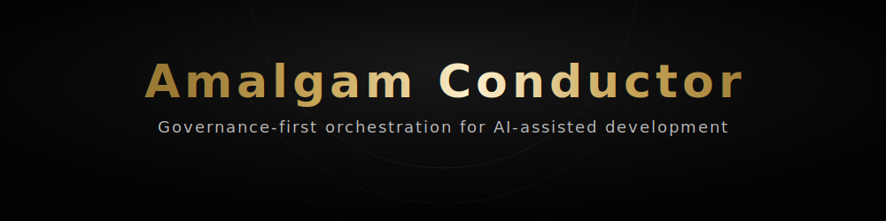
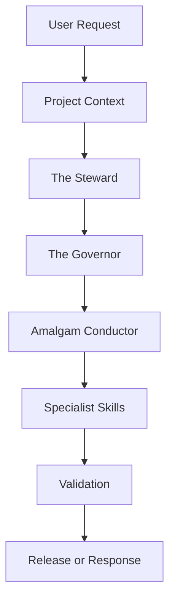

<div align="center">
  

  <h1>Amalgam Conductor</h1>

  <p>
    <strong>Project-agnostic governance and orchestration framework for AI-assisted development.</strong>
  </p>

  <p>
    Governance-first routing for business alignment, compliance awareness, specialist execution, and token-efficient implementation workflows.
  </p>

  <p>
    <a href="#installation">Installation</a> •
    <a href="#how-to-use">How to Use</a> •
    <a href="#governance-layer">Governance Layer</a> •
    <a href="#token-efficient-usage">Token Efficiency</a> •
    <a href="#validation">Validation</a>
  </p>

  <p>
    
    
    
    
  </p>
</div>

---

## At a Glance

| Layer | Role | Purpose |
|---|---|---|
| Governance | The Steward | Business, scope, SDLC, requirements, and value alignment |
| Governance | The Governor | Legal risk, privacy, IP, licensing, security, and compliance review |
| Orchestration | Amalgam Conductor | Routes approved work to the correct specialist skills |
| Execution | Specialist Skills | Performs focused implementation, documentation, QA, security, or design work |

## Core Concept

Amalgam Conductor uses a governance-first workflow. The Steward checks whether a request aligns with project goals, scope, requirements, and SDLC documentation. The Governor checks whether the request raises legal, privacy, IP, licensing, security, or compliance concerns. Once governance review is complete, the Amalgam Conductor routes approved work to the correct specialist skills.

## Governance and Orchestration Architecture



---

## Governance Layer

Before any implementation begins, the Governance Layer intercepts the request. It acts as a project-agnostic authority that scales its review depth based on the specific project context and risk level (LOW / MEDIUM / HIGH).

> [!IMPORTANT]
> If a request violates business alignment, misses required documentation, or breaches compliance boundaries, the Governance Layer returns a `REVISION_REQUIRED` or `BLOCKED` decision. The Conductor cannot override these gates and will pause or stop execution until the issues are addressed.

### The Steward

**Primary Mission:** Validates business alignment, scope, and software development lifecycle (SDLC) documentation.

The Steward ensures that every feature or change:
- Supports the project's core objectives.
- Meets documented requirements and acceptance criteria.
- Stays within the defined scope.
- Includes sufficient documentation for the development phase.

### The Governor

**Primary Mission:** Validates legal compliance, privacy, IP, copyright, licensing, and security boundaries.

The Governor ensures that every change:
- Complies with open-source licenses and third-party attribution.
- Protects user privacy and handles data properly.
- Respects IP and copyright ownership.
- Flags uncertain regulatory or legal issues for human review (`human_review_required: true`).
- Validates audit readiness.

*Note: The Governor does not provide legal advice. It identifies risks and required documentation.*

---

## The Amalgam Conductor

The **Amalgam Conductor** acts as the primary Orchestrator. 
- It evaluates the governance decisions and routes approved work to the correct implementation specialists.
- It prevents sequencing errors, unauthorized actions, and overlapping reviews.
- It ensures that code generation defaults to logical implementation paths (e.g., standard libraries before external dependencies).

## Specialist Skills

When Amalgam Conductor identifies a cross-domain feature, it routes the task to the appropriate specialist.

| Specialist | Use Case | Avoid When |
| :--- | :--- | :--- |
|  **Amalgam Conductor** | Routing, overlap control, token efficiency | A single obvious specialist suffices |
|  **Clockwork Meister** | OOP/Layered architecture, system design, refactoring | Modifying UI or writing docs |
|  **Cloak Meister** | UI/UX, layout, components, accessibility | DB or system-diagram ownership |
|  **Meister Chronicler**| DB schema, migrations, SQL, constraints | UI review |
|  **Scribe Meister** | Documentation, READMEs, technical writing | Inventing technical facts |
|  **Meister Weaver** | UML, ERD visuals, workflow diagrams | DB semantics without source |
|  **Acme Overseer** | QA, tests, release readiness, regression | Destructive pressure testing |
|  **Cipher Meister** | Security/privacy evidence, auth, secrets | Offensive testing |
|  **Hidden Dagger** | Approved destructive/resilience testing | Unauthorized testing |

> [!TIP]
> See [SKILL_INDEX.md](SKILL_INDEX.md) for the full specialist index and their expected behavior.

---

## Installation

Amalgam Conductor can be installed as a native plugin in both Antigravity and Codex.

### Antigravity Plugin Setup
```sh
agy plugin install https://github.com/Baelfyre/amalgam-conductor
```

### Codex Plugin Setup
Clone the repository into your Codex plugins directory:
```sh
git clone https://github.com/Baelfyre/amalgam-conductor.git
```
Codex will automatically detect the `.codex-plugin/plugin.json` manifest and map the `skills/` directory.

*For manual setup, see [INSTALLATION.md](INSTALLATION.md).*

## How to Use

1. **Provide Project Context**: The Governance Layer needs to know what it's reviewing. Provide a basic project context (e.g., "This is an internal prototype" or "This is a public commercial release") so it can scale its review risk appropriately.
2. **Start with the Orchestrator**: Use the `/amalgam-conductor` skill for any multi-file or cross-domain feature. It will pass your request through the Governance Gate before sequencing the required specialists.
3. **Use Specialists for Single Tasks**: If you know exactly what you need (e.g., UI layout), route directly to the relevant specialist (e.g., `/cloak-meister`).
4. **Follow the Gates**: If you hit a `REVISION_REQUIRED` block, address the findings (e.g., missing requirements document, missing NOTICE file) before re-requesting.

## Recommended Prompt Workflow

The best way to use the ecosystem is to treat the Governance Layer as a partner in refining your prompt and plan:
1. Submit a raw idea or request.
2. Let The Steward and The Governor audit it. They will output missing requirements, scope risks, or compliance gaps.
3. Use their feedback to create the missing artifacts (e.g., a brief Requirements Document or an updated Privacy Policy).
4. Resubmit the request. It will clear the Governance Gate and the Conductor will orchestrate a smooth, aligned implementation.

---

## Token-Efficient Usage

> [!TIP]
> The ecosystem uses a token-efficient communication standard that strips out conversational filler, ensuring only actionable code and necessary context are passed between agents. All specialist output defaults to a compressed protocol that minimizes token consumption.

## Fast Path

The ecosystem uses a fast-path rule for rapid iteration:
For trivial requests, typo fixes, formatting edits, or local changes, the Governance Layer returns a compact `NOT_APPLICABLE` message with near-zero overhead.

## Expanded Governance Review

Expanded governance documentation and full audits are only loaded and output when the risk is `MEDIUM` or `HIGH`, or when specific compliance/scope issues are triggered (e.g., public release, handling user data, legal concerns).

---

## Validation

Fully automatic updates to skill instructions can silently break AI workflows. Run the included PowerShell script to check your local structure and ensure all required files are present.

```powershell
powershell -ExecutionPolicy Bypass -File .\scripts\validate-structure.ps1
```

To verify that the `plugin.json` manifest perfectly matches the actual SKILL.md frontmatter across all skills:

```powershell
powershell -ExecutionPolicy Bypass -File .\scripts\validate-manifest.ps1
```

## Repository Structure

- `assets/` - Icons, banners, and logos.
- `docs/` - System architecture and governance reference documentation.
- `scripts/` - Validation and update utilities.
- `skills/` - The source of truth for all specialist and governance skills.
- `.agents/` - Mirrored skills for IDE agent integration.
- `tests/` - Validation scenarios and behavior tests.

## Current Limitations

**Instruction-Level Enforcement:** 
Current enforcement relies on instruction-level governance. The Amalgam Conductor is explicitly instructed to follow the governance gate decisions before planning or routing work. However, no automated runtime blocker currently prevents an execution agent from making changes if it hallucinates or ignores the `BLOCKED` status. Automated runtime enforcement (such as CI checks, schema validation, or automated release gates) may be implemented in the future if required.

## Disclaimer

> [!CAUTION]
> Please read the [DISCLAIMER.md](DISCLAIMER.md) before using this ecosystem in real-world applications or production environments. The Governor provides automated compliance checks but does not provide legal advice.
