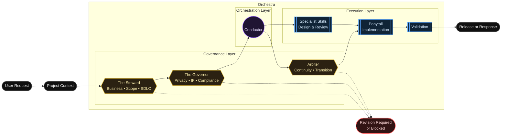

<div align="center">
  

  <p>
    <strong>Project-agnostic governance and orchestration framework for AI-assisted development.</strong>
  </p>

  <p>
    <a href="docs/setup/INSTALLATION.md">Installation</a> •
    <a href="docs/governance/GOVERNANCE_LAYER.md">Governance</a> •
    <a href="SKILL_INDEX.md">Skills</a> •
    <a href="docs/setup/VALIDATION.md">Validation</a>
  </p>
  <p>
    <a href="https://github.com/Baelfyre/Orchestra/actions/workflows/validate.yml">
      
    </a>
  </p>
</div>

---

## At a Glance

| Layer | Role | Purpose |
|---|---|---|
| Governance | The Steward | Business, scope, SDLC, requirements, and value alignment |
| Governance | The Governor | Legal risk, privacy, IP, licensing, security, and compliance review |
| Governance | Arbiter | Continuity, validation, transition governance, and merge readiness |
| Orchestration | Conductor | Routes approved work to the correct specialist skills |
| Execution | Specialist Skills | Performs focused architecture, documentation, QA, security, or design work |
| Execution | Ponytail | Implementation, code navigation, and safe edits |

## Core Concept

Orchestra uses freedom-first, need-based governance. Users can ideate freely. Governance review is invoked when the task requires alignment review, implementation readiness, audit, risk review, or release validation. The governance layer does not assume what rules apply to every project. Before review, The Steward and The Governor establish the Governance Basis of Review based on the active operating mode and supplied context. If the scope is unclear and review is required, governance returns `REVISION_REQUIRED` instead of assuming.

## Architecture



---

## Governance Layer

The Governance Layer sits above the Conductor. Orchestra uses freedom-first, need-based governance. Users can ideate freely. Governance review is invoked when the task requires alignment review, implementation readiness, audit, risk review, or release validation.

The Steward and The Governor are entirely context-driven. They do not pre-assume what rules apply to every project, nor do they apply every governance rule universally. If the project scope is unclear or missing, governance returns `REVISION_REQUIRED` instead of assuming. Conversely, if a risk area does not apply to the current context, the authority returns `NOT_APPLICABLE`.

> [!IMPORTANT]
> If a request violates alignment, fails scope verification, or breaches compliance boundaries, the Steward or Governor issues a `REVISION_REQUIRED` or `BLOCKED` status. The Conductor will immediately halt execution.

### Operating Modes

Conductor uses 5 distinct operating modes to scale governance dynamically, ensuring that ideation and dynamic prototyping are not restricted:

1. **Ideation Mode**: Brainstorming, exploration, planning, concept development, prompt refinement. Returns `ADVISORY_ONLY` or `NOT_APPLICABLE`.
2. **Prototype Mode**: Local experiments, throwaway proofs-of-concept. Lightweight checks only.
3. **Implementation Mode**: Making file, code, documentation, or architecture changes. Uses fast path by default. Escalate to expanded review only if risk triggers are met.
4. **AUDIT mode**: Explicit request for a review, compliance check, or risk assessment. Context-heavy.
5. **Release Mode**: Production deployment, public release, client delivery, or open-source distribution. Strictest path. Escalate uncertain issues for human review.

### Interpret the Decision

| Decision | Meaning | User Action |
|---|---|---|
| **APPROVED** | Work can proceed | Let the conductor route the task |
| **ADVISORY_ONLY** | Advice given, exploration unblocked | Continue brainstorming or prototyping freely |
| **REVISION_REQUIRED** | More context or correction is needed | Add missing details and resubmit |
| **BLOCKED** | Work should not proceed as requested | Resolve the blocking issue first |
| **NOT_APPLICABLE** | Governance check is not needed | Continue with the fast path |

---

## Governance Authorities and Specialist Skills

### Governance Authorities

| Authority | Focus |
|---|---|
|  **The Steward**, Business Alignment | Business alignment, scope boundaries, and software development lifecycle (SDLC) documentation. |
|  **The Governor**, Legal and Compliance | Evaluates legal compliance, privacy risks, intellectual property (IP), licensing, and security policies. |
|  **Arbiter**, Continuity and Validation | Continuity, validation-state review, branch transition, and source-of-truth governance. |

### Specialist Skills

| Skill | Focus |
|---|---|
|  **Conductor**, Routing | Routing and orchestration |
|  **Ponytail**, Implementation | Implementation and safe code edits |
|  **Clockwork**, Architecture and Refactoring | Architecture, OOP, refactoring |
|  **Cloak**, UI and Accessibility | UI, UX, layout, accessibility |
|  **Scribe**, Documentation | Documentation and technical writing |
|  **Weaver**, Visual Modeling | Visual modeling and diagram specialist |
|  **Chronicler**, Database and Schema | Database architect and schema auditor |
|  **Overseer**, QA and Release Readiness | QA, testing, release readiness |
|  **Cipher**, Security and Privacy | Security and privacy evidence |
|  **Dagger**, Resilience Testing | Controlled resilience tester |

For details on all execution skills, routing logic, and behavioral constraints, see the [Specialist Skill Index](SKILL_INDEX.md).

---

## Installation by AI Host or IDE

Orchestra can be used across different AI-assisted development environments, but each host loads skills differently. The installation method depends on the AI host you are using.

### Installation Summary

| Host / IDE                |                     Installation Scope | How Orchestra Loads                                                   | Recommended Setup                                   |
| ------------------------- | -------------------------------------: | --------------------------------------------------------------------- | --------------------------------------------------- |
| Antigravity / `agy`       |                                 Global | Installed as an Antigravity plugin                                    | Use `agy plugin install` once                       |
| Codex                     |                       Per project repo | Reads `.agents/skills` inside the target repo                         | Install only into repos where Codex needs Orchestra |
| VS Code                   | Per extension or per repo instructions | Depends on the AI extension, such as Copilot or Continue              | Use instruction files, not full skill folders       |
| IntelliJ / JetBrains IDEs | Per plugin or per project instructions | Depends on JetBrains AI Assistant, Copilot, Junie, or similar plugins | Use instruction files or project docs               |
| Other AI coding tools     |                          Tool-specific | Usually reads repo instructions, rules, or prompt files               | Adapt Orchestra as project instructions             |

---

### Antigravity Setup

Antigravity uses `agy` plugins. This is the cleanest setup because the plugin is installed globally and can be used across Antigravity workspaces.

```powershell
agy plugin install https://github.com/Baelfyre/Orchestra
```

Verify installation:

```powershell
agy plugin list
```

Expected result should include:

```text
conductor
```

Use Orchestra in Antigravity with:

```text
/ponytail /conductor
```

Notes:

* Antigravity does not require `.agents/skills` inside each project repo.
* Removing local Codex folders from a project does not affect Antigravity.
* This is the recommended setup for users who want one global Orchestra installation.

---

### Codex Setup

Codex users can install Orchestra globally through the Marketplace, or locally per-project.

#### Install in Codex through Marketplace

1. Open Codex.
2. Go to Plugins.
3. Open Marketplace.
4. Paste this GitHub repository URL into the Source field:

   https://github.com/Baelfyre/Orchestra

5. Add the marketplace source.
6. Restart Codex.
7. Go back to Plugins.
8. Open Personal.
9. Search for Orchestra.
10. Click Install.
11. Confirm that Orchestra appears as installed or enabled.

If Orchestra does not appear under Personal after adding the marketplace source, restart Codex again and check that the repository URL was entered correctly.

#### Install locally per-project

Codex uses a repo-local skill model. Orchestra skills must be installed into the project repo where Codex will run.

The target layout is:

```text
<ProjectRepo>/.agents/skills/
```

Example:

```text
C:\YourProject\.agents\skills\conductor
C:\YourProject\.agents\skills\scribe
C:\YourProject\.agents\skills\clockwork
```

Install Orchestra Codex skills into a target project repo:

```powershell
cd C:\conductor

powershell -NoProfile -ExecutionPolicy Bypass -File .\scripts\refresh-installed-integrations.ps1 -Target Codex -CodexRepoPath "C:\path\to\your\project" -Force
```

Important:

* Codex installation is per project repo.
* Only install Codex skills into repos where you actively want Codex to use Orchestra.
* Do not install Codex skills into every repo by default.
* If `.agents/` is only for local Codex use, do not commit it.

For local-only Codex installs, add this to the target repo local Git exclude file:

```text
.git/info/exclude
```

Recommended local-only entries:

```gitignore
.agents/
.amalgam/
```

This keeps the files available locally without adding them to the shared repository.

Use `.gitignore` only if the whole project intentionally wants to share those AI configuration files with all contributors.

---

### VS Code Setup

VS Code does not use `agy` plugins and does not automatically load Orchestra skill folders unless an extension specifically supports them.

Most VS Code AI workflows are extension-driven, such as:

* GitHub Copilot
* Continue
* Cody
* CodeGPT
* other local or cloud AI extensions

Recommended setup:

* Do not copy the full Orchestra skill folders into every VS Code project.
* Use a lightweight instruction file if the AI extension supports it.
* Keep project-specific AI guidance small, clear, and intentional.

For GitHub Copilot, a common project instruction file is:

```text
.github/copilot-instructions.md
```

Suggested content:

```markdown
# Copilot Instructions

Use Orchestra-style workflow guidance.

Default routing pattern:
`/ponytail /conductor`

Prioritize:
- Small, targeted changes.
- SOLID and OOP compliance where applicable.
- No broad rewrites unless requested.
- Preserve existing architecture unless the task explicitly asks to refactor.
- Run available validation before finalizing.
- Return changed files, summary, validation results, risks, and next step.
```

Commit this file only if the repository should permanently share these AI instructions.

#### Optional: Agentic Skill Installer Extension

VS Code users may optionally use the **Agentic Skill Installer** extension to browse, install, and update Orchestra skills, prompts, and agents from GitHub repositories directly inside VS Code.

Basic setup flow:

```text
1. Install the Agentic Skill Installer extension from the VS Code Marketplace.
2. Open the Agentic Skill Installer panel from the VS Code Activity Bar.
3. Click Install Source Repository or Add Source Repository.
4. Paste the Orchestra repository URL:
   https://github.com/Baelfyre/Orchestra
5. Let the extension scan the repository and load the available skills / agents.
6. Install or use only the skills needed for the active workspace.
7. Run git status before committing to confirm no local-only skill files were added unintentionally.
```

---

### IntelliJ / JetBrains IDE Setup

IntelliJ and other JetBrains IDEs do not use `agy` plugins. AI behavior depends on the installed plugin, such as:

* JetBrains AI Assistant
* GitHub Copilot for JetBrains
* Junie
* other third-party AI coding plugins

Recommended setup:

* Do not add `.agents/skills` unless the AI tool specifically requires it.
* Use IDE chat instructions, project documentation, or a small AI workflow guide.
* If the guidance should be shared with contributors, document it in the repo.
* If it is only for local use, keep it outside Git tracking.

Optional shared project file:

```text
docs/AI_WORKFLOW.md
```

Suggested instruction pattern:

```text
Use Orchestra-style workflow guidance.
Default to /ponytail /conductor for multi-step tasks.
Prefer small, reviewable changes.
Preserve existing project structure.
Validate before summarizing.
Report changed files, validation results, remaining risks, and next recommended step.
```

---

### Local-Only vs Shared AI Configuration

Use this rule of thumb:

| Scenario                         | Recommended Location              |                     Commit It? |
| -------------------------------- | --------------------------------- | -----------------------------: |
| Antigravity global plugin        | `agy plugin install`              |        No project files needed |
| Codex local-only testing         | `.agents/skills`                  |                             No |
| Codex shared team workflow       | `.agents/skills`                  |       Yes, only if intentional |
| Copilot project instructions     | `.github/copilot-instructions.md` | Yes, if useful to contributors |
| Personal IDE prompt notes        | Outside repo or local notes       |                             No |
| General project AI workflow docs | `docs/AI_WORKFLOW.md`             | Yes, if useful to contributors |

---

### Recommended Default Setup

For most users:

```text
Antigravity:
Install globally with agy.

Codex:
Install per repo only when needed.

VS Code:
Use extension-specific instruction files.

IntelliJ:
Use plugin-specific instructions or project docs.

Other IDEs:
Check whether the AI host supports repo instructions, skill folders, or plugins.
```

Do not assume all IDEs use the same plugin model. Antigravity uses a global plugin model, Codex uses repo-local skills, and most traditional IDEs use extension-specific instructions.

For manual configurations or environment setup details, see the [Installation Guide](docs/setup/INSTALLATION.md).

---

### Ponytail and Caveman Notice

Ponytail and Caveman are external tools. They are not included, vendored, or required by Orchestra. Install them separately from their official repositories if desired:

- Ponytail: https://github.com/DietrichGebert/ponytail
- Caveman: https://github.com/JuliusBrussee/caveman

Orchestra may reference Ponytail and Caveman as workflow companions for focused implementation and compressed communication, but they remain separate from the Orchestra plugin and skill package.

For more details on the boundary between Orchestra and these tools, see the [External Companions](docs/integrations/EXTERNAL_COMPANIONS.md) guide.

---

## Quick Start Usage

### 1. Start with a project context

The governance layer does not assume what rules apply. Provide enough context for The Steward and The Governor to know what they are reviewing.

Minimum context:
- **Project Type**: e.g., open-source repo, internal tool
- **Goal**: What the task should accomplish
- **Release Target**: e.g., local only, public release
- **Data Use**: e.g., no user data, sensitive data
- **Dependencies**: e.g., libraries, assets
- **Constraints**: e.g., files to preserve, style rules

### 2. Use the standard prompt pattern

Add this template to the top of your request:

```text
[@ponytail] use conductor for this task

Project Context:
Project Type:
Goal:
Release Target:
Data Use:
Dependencies or Third-Party Assets:
Constraints:

Task:
Describe the work clearly.

Requirements:
- List what must be changed.
- List what must be preserved.
- List any rules the implementation must follow.

Expected Output:
Changed Files:
Summary:
Validation Results:
Remaining Risks:
Next Recommended Step:
```

### 3. Review the IDE output and Iterate

Follow this feedback loop:
1. Send the refined prompt to the IDE.
2. Let the IDE inspect files and propose changes.
3. Review changed files and validation results.
4. Approve, revise, or ask for another iteration.
5. Commit only after validation passes.

> [!NOTE]
> When unsure which specialist to use, start with **Conductor**. It can route the task to the correct specialist. Use a specialist directly only when the task is narrow and obvious (e.g., UI only, QA only).

---

## Output Mode Behavior

Output from Conductor and its specialists automatically adapts to your intent:
- **Compact mode** is the default for normal iterative tasks.
- **Full mode** is used only when explicitly requested for formal audits, deep reviews, or comprehensive planning.
- **Specialized modes** (like Diagram formats) are automatically selected when the artifact type is clear.
- **Clarification** is only asked when output intent is ambiguous.

---

## Token-Efficient Usage

> [!TIP]
> For best token efficiency:
> - Start with a refined prompt.
> - Provide only relevant project context.
> - Ask for changed files, summary, validation, risks, and next step.
> - Do not request expanded governance analysis unless the task is MEDIUM or HIGH risk.
> - Use fast path for typo fixes, formatting edits, and local documentation cleanup.
> - Link to detailed governance docs instead of repeating them in your prompt.

---

## Maintainer Entry Points & Documentation Map

### Maintainer Entry Points

- [Router-first architecture](docs/routing/ROUTER_FIRST_ARCHITECTURE.md): Core design of the minimal-context routing model.
- [Context retrieval rules](docs/routing/CONTEXT_RETRIEVAL_RULES.md): Rules for loading dynamic context by operating mode.
- [Minimal prompt format](docs/routing/MINIMAL_PROMPT_FORMAT.md): Specifications for the minimal routing prompt.
- [Execution modes policy](docs/routing/EXECUTION_MODES_POLICY.md): Policies for FAST, STANDARD, GOVERNED, AUDIT, and DESTRUCTIVE modes.
- [Router benchmark runner](docs/testing/ROUTER_BENCHMARK_RUNNER.md): Execution logic for validating benchmark definitions.
- [Router benchmark maintenance guide](docs/testing/ROUTER_BENCHMARK_MAINTENANCE_GUIDE.md): Instructions for adding or modifying benchmark cases.
- [Router benchmark coverage completion review](docs/testing/ROUTER_BENCHMARK_COVERAGE_COMPLETION_REVIEW.md): Analysis of coverage across all 24 benchmark cases.
- [Prompt load metrics](docs/performance/PROMPT_LOAD_METRICS.md): Documentation on token footprint estimation and tracking.
- [Prompt load threshold policy](docs/performance/PROMPT_LOAD_THRESHOLD_POLICY.md): Policies and soft limits for prompt load size.
- [Prompt load threshold checker](docs/performance/PROMPT_LOAD_THRESHOLD_CHECKER.md): Dry-run validation script for tracking prompt load limits.
- [CI artifact index](docs/testing/CI_ARTIFACT_INDEX.md): Directory of generated CI validation and governance reports.
- [Issue #56 closeout note](docs/routing/ISSUE_56_CLOSEOUT_NOTE.md): Final closeout note and GitHub closing comment for Issue #56.
- [Final router-first readiness review](docs/routing/ROUTER_FIRST_FINAL_READINESS_REVIEW.md): Readiness review for closing Issue #56.
- [Phase 8 router-first hardening completion review](docs/routing/ROUTER_FIRST_HARDENING_COMPLETION_REVIEW.md): Final completion review and deferred items for Phase 8.
- [Phase 8A integration hardening audit](docs/routing/ROUTER_FIRST_INTEGRATION_HARDENING_AUDIT.md): Gap analysis and recommended hardening actions.

### Common Maintainer Tasks

- To understand routing behavior, start with [ROUTER_FIRST_ARCHITECTURE.md](docs/routing/ROUTER_FIRST_ARCHITECTURE.md).
- To add benchmark cases, start with [ROUTER_BENCHMARK_MAINTENANCE_GUIDE.md](docs/testing/ROUTER_BENCHMARK_MAINTENANCE_GUIDE.md).
- To inspect CI outputs, start with [CI_ARTIFACT_INDEX.md](docs/testing/CI_ARTIFACT_INDEX.md).
- To inspect prompt size, start with [PROMPT_LOAD_METRICS.md](docs/performance/PROMPT_LOAD_METRICS.md).
- To check threshold status, start with [PROMPT_LOAD_THRESHOLD_CHECKER.md](docs/performance/PROMPT_LOAD_THRESHOLD_CHECKER.md).
- To review Phase 8 hardening gaps, start with [ROUTER_FIRST_INTEGRATION_HARDENING_AUDIT.md](docs/routing/ROUTER_FIRST_INTEGRATION_HARDENING_AUDIT.md).


| Area | Start Here | Purpose |
|---|---|---|
| Governance | [Governance Layer](docs/governance/GOVERNANCE_LAYER.md) | Understand The Steward, The Governor, risk scaling, and release gates |
| Skills | [Skill Index](SKILL_INDEX.md) | Review available specialists and routing behavior |
| Installation | [Installation Guide](docs/setup/INSTALLATION.md) | Set up the plugin in Antigravity, Codex, VS Code, or JetBrains IDEs |
| Changelog | [Changelog](CHANGELOG.md) | Track release history and documented repo milestones |
| Validation | [Validation Guide](docs/setup/VALIDATION.md) | Run structure and manifest checks |
| Routing | [Router Architecture](docs/routing/ROUTER_FIRST_ARCHITECTURE.md) | Understand the router-first model and context retrieval |
| Performance | [Prompt Load Metrics](docs/performance/PROMPT_LOAD_METRICS.md) | Track prompt load and threshold policies |
| Benchmarks | [Benchmark Validation](docs/testing/ROUTER_VALIDATION_BENCHMARKS.md) | Review the router validation testing suite |
| CI Artifacts | [CI Artifact Index](docs/testing/CI_ARTIFACT_INDEX.md) | Browse governance reports and validation CI artifacts |
| Audits | [Phase 8A Audit](docs/routing/ROUTER_FIRST_INTEGRATION_HARDENING_AUDIT.md) | Review the router-first integration hardening audit |
| Maturity | [Maturity](docs/MATURITY.md) | Current project stability and roadmap |
| Contributing | [Contributing Guide](docs/CONTRIBUTING.md) | Guidelines for contributing and safety policies |
| Disclaimer | [Disclaimer](docs/meta/DISCLAIMER.md) | Understand legal and operational limitations |

## Validation & Enforceable Governance

Orchestra's rules are divided into clear enforcement levels to distinguish between advisory instruction and guaranteed validation:

### Enforcement Model
- **Level 1: Instruction governance**. (Advisory) The host AI is instructed to follow The Steward and The Governor. Conductor is instructed to halt if governance returns BLOCKED.
- **Level 2: Structural validation**. (Enforced Locally/CI) Scripted checks ensure manifests, skills, and formats align.
- **Level 3: Runtime guardrail scan**. (Warning-only Default) Scripted checks for secrets, PII, and copyleft licenses. Exits with code `0` by default.
- **Level 4: Strict local enforcement**. (Opt-in) Strict enforcement of guardrails locally (`$env:ORCHESTRA_ENFORCE_GUARDRAILS = "true"`), failing the process on violation.
- **Level 5: CI release gate**. (Enforced in CI) Build pipeline fails if structural validation or strict guardrails fail.
- **Level 6: Host-integrated runtime blocker**. (Future) Host platform forcibly blocks output if policies are violated.

Before releasing, staging, or pushing changes, run the centralized behavior validation suite:

```powershell
# Run all validation checks (structure, manifest, stale references, and locking tests)
powershell -NoProfile -ExecutionPolicy Bypass -File .\tests\behavior\run-tests.ps1
```

### Governance Verification Workflow
- **Centralized Test Runner (`run-tests.ps1`)**: Verifies project directory structure, manifest definitions against skill frontmatter, stale reference checks, Codex skill adapter alignment, and lock/guardrail regression cases.
- **Opt-In Runtime Guardrails**: Scans staged or modified files for security risks (secrets, copyleft licenses, PII leaks, destructive commands, or stale naming conventions).
  - *Warning-Only Mode (Default)*: Scans are advisory and exit with code `0`.
  - *Strict Enforcement*: Set `$env:ORCHESTRA_ENFORCE_GUARDRAILS = "true"` to fail the build (exit code `1`) upon safety violations.
- **Workspace State Locking**: Manages a `.amalgam/lock.json` file during workflow executions to prevent concurrent agent collisions, automatically detecting and cleaning stale locks based on process ID (PID) liveness.

For full configuration and usage instructions, see the [Validation & Enforceable Governance Guide](docs/setup/VALIDATION.md).

---

## Limitations

- **Instruction-Level Framework:** Orchestra primarily operates through structured instructions, skills, and documentation.
- **Optional Runtime Guardrails:** Some repository-level checks can be enforced through scripts when explicitly enabled.
- **Human Review Required:** Guardrails reduce risk but do not replace developer review, secure coding practice, or legal/security review.
- **Project Profile Requirement:** Governance relies entirely on the accuracy and completeness of the provided project context profile.

## Collapsed Repository Structure

GitHub displays repository files above the README by default. This README keeps detailed documentation layered into linked files and collapsed sections to reduce scrolling.

<details> <summary>Repository structure</summary>

```
skills/
├── arbiter/
├── chronicler/
├── cipher/
├── cloak/
├── clockwork/
├── conductor/
├── dagger/
├── overseer/
├── ponytail/
├── scribe/
├── the-governor/
├── the-steward/
└── weaver/

docs/
├── CONTRIBUTING.md
├── governance/
│   ├── GOVERNANCE_LAYER.md
│   ├── GOVERNOR.md
│   ├── STEWARD.md
│   ├── GOVERNANCE_REVIEW_FLOW.md
│   └── RELEASE_GATES.md
├── meta/
│   ├── CHANGELOG.md
│   └── DISCLAIMER.md
├── project/
│   ├── FOUNDATION.md
│   ├── ROADMAP.md
│   ├── PLUGIN_READINESS.md
│   ├── MANIFEST_SCHEMA.md
│   └── V1_READINESS_CHECKLIST.md
└── setup/
    ├── INSTALLATION.md
    ├── LOCAL_ONLY_GUIDE.md
    ├── COMPATIBILITY.md
    └── VALIDATION.md

tests/behavior/
└── GOVERNANCE_SCENARIOS.md

assets/readme/
└── orchestra-governance-banner.svg
```

</details>

## Disclaimer

> [!CAUTION]
> The Governor and Steward skills validate compliance frameworks, scope, and best practices. They do not provide legal advice or absolute security guarantees. Please read [docs/meta/DISCLAIMER.md](docs/meta/DISCLAIMER.md) for full terms.
