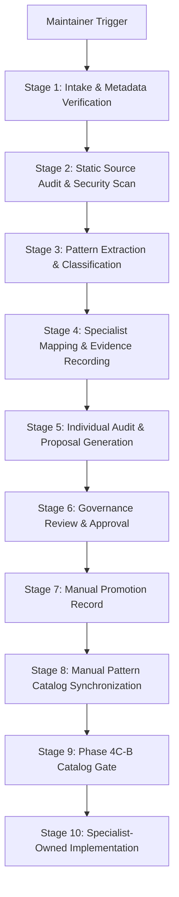

# Artificer Evolution Workflow

This document defines the structured workflow for importing and evaluating external design patterns to evolve Orchestra.

Phase 4B validates reviews, governance decisions, proposals, promotions, and cross-record relationships deterministically. Empty governance registries remain valid; Artificer has no approval or implementation authority and never clones, installs, compiles, or executes external sources. Phase 4C-A provides read-only deterministic Markdown rendering of validated audit JSON to standard output. Rendered Markdown is not governance authority, JSON records remain canonical, and no Pattern Catalog mutation occurs. Phase 4C-B separately owns Pattern Catalog synchronization and gating; Phase 4.5 owns the OpenHero and Strix pilot audits.

## End-to-End Workflow Stages

---

### Stage 1: Intake & Metadata Verification
1. Receive explicit maintainer request specifying an external repository.
2. Retrieve source metadata and validate it against `SOURCE_INTAKE_SCHEMA.json`.
3. Stop if metadata is incomplete, or if the license is invalid/incompatible.

### Stage 2: Static Source Audit & Security Scan
1. Inspect the external repository through an approved read-only source connector at a pinned commit SHA. Do not clone, fetch, install, compile, or execute the external repository inside the Orchestra workspace.
2. Run static analysis only.
3. Check for security hazards:
   - Secret keys, API tokens, endpoints.
   - Instructions embedded in files or README docs designed to manipulate the agent.
   - Code that attempts to run subprocesses or invoke shell interpreters.

### Stage 3: Pattern Extraction & Classification
1. Identify Candidate Design Patterns within the examined code.
2. Assess and apply the appropriate classification from `PATTERN_CLASSIFICATION.md`.
3. Group multiple patterns found in a single source.

### Stage 4: Specialist Mapping & Evidence Recording
1. Map each candidate pattern to its canonical Orchestra specialist domain (e.g. UX to Cloak, DB to Chronicler, Security to Cipher).
2. Record evidence of functionality (e.g. compile checks, API signatures, runtimes).

### Stage 5: Individual Audit & Proposal Generation
1. Produce the Source Audit report using the format defined in `OUTPUT_FORMATS.md`.
2. Generate the Amalgamated Orchestra Evolution Proposal.

### Stage 6: Governance Review & Approval
1. **Arbiter**: Reviews evidence and checks for duplicate patterns.
2. **The Governor**: Verifies license compatibility, copyright notice preservation, and IP clearance.
3. **The Steward**: Reviews business alignment and scope.
4. **Maintainer**: Gives final approval.

### Governed Promotion Sequence
Approved Decision -> Approved Proposal -> Manual Promotion Record -> Manual Pattern Catalog Synchronization -> Phase 4C-B Catalog Gate -> Specialist-Owned Implementation

### Stage 7: Manual Promotion Record
1. Once governance approval exists, a maintainer manually creates the promotion record.
2. Promotion remains manual and the JSON promotion record is canonical.

### Stage 8: Manual Pattern Catalog Synchronization
1. A maintainer manually synchronizes `docs/internal/PATTERN_CATALOG.md` with the validated promotion registry.
2. The Catalog is a human-readable projection only and must never be updated automatically by Artificer.

### Stage 9: Phase 4C-B Catalog Gate
1. Run `python scripts/validate_artificer_pattern_catalog.py`.
2. `IMPLEMENTING`, `IMPLEMENTED`, and `RETIRED` remain specialist- or maintainer-controlled lifecycle states mirrored from the promotion record.

### Stage 10: Specialist-Owned Implementation
1. Once the Catalog gate passes, the pattern is implemented on a separate branch.
2. The implementation is owned by the designated Orchestra specialist (e.g. Cloak for frontend, Clockwork for backend structure), not by Artificer.

### Phase 4.5 Pilot Sequence
Maintainer Authorization -> High-Risk Source Classification -> Pinned External Commit -> Restricted Static Source Selection -> Read-Only Inspection -> Immutable Source Intake -> Immutable Pattern Records -> Governed Audit Report -> Independent Audit Review -> Later Manual Governance Decision

The Strix pilot is a high-risk offensive-security audit and does not advance automatically into execution, vulnerability testing, proposals, promotions, Catalog synchronization, or implementation.

### Phase 5 Governance Decision Recording
Completed Audit -> Independent Read-Only Review -> Maintainer Adoption -> Governed Decision Record -> Later Proposal Selection

*   Phase 5B-A records the five OpenHero decisions only.
*   Three patterns are approved for concept-only proposal eligibility.
*   One UI pattern is deferred with concept-only restriction.
*   One security anti-pattern is rejected and implementation-blocked.
*   Decision creation does not automatically create an evolution proposal.
*   Strix decisions are excluded from Phase 5B-A.
*   Manual promotion and Pattern Catalog lifecycle remain unchanged and separate from Phase 5B-A.
